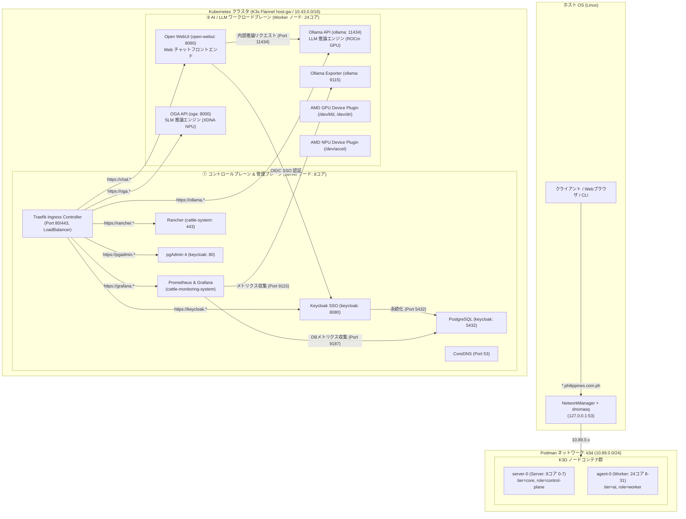

# ネットワーク構成仕様書 (NETWORK.md)

## 1. 概要

本ドキュメントは、Podman 上で稼働するローカル AI 特化型 K3D Kubernetes クラスタ（クラスタ名: `ollama-cluster`）におけるネットワークアーキテクチャ、名前解決、トラフィックフロー、およびセキュリティ分離設計について定義します。

本クラスタのネットワークは、ホストOSからコンテナランタイム、Kubernetes 内部オーバーレイ、Ingress、および NetworkPolicy によるアクセス制御まで、多層防御と低遅延 AI 推論を重視した設計となっています。

ホストの CPU リソースを **Server ノード (8コア: 0-7)** と **Worker ノード (24コア: 8-31)** に厳密に分離し、管理トラフィックと高負荷 AI 推論トラフィックを分離しています。

---

## 2. ネットワーク全体アーキテクチャ



---

## 3. レイヤー別詳細仕様

### レイヤー 1: ホストOS & DNS 名前解決レイヤー

ホストOS上の Web ブラウザや CLI から、クラスタ内の各公開サービス（`*.${EMAIL_DOMAIN}`、既定値: `*.philippines.com.ph`）へアクセスするための名前解決基盤です。
すべてのドメイン名および公開・内部 URL は `ansible/group_vars/all.yml` および `config.env` を通じて一元管理・変数化されています。

- **DNS フォワーダ**: NetworkManager 内蔵の `dnsmasq` 子プロセスを利用
- **リッスンアドレス**: `127.0.0.1:53`
- **設定ファイル**:
  - `/etc/NetworkManager/dnsmasq.d/k3d.conf`:
    ```ini
    address=/.philippines.com.ph/127.0.0.1
    ```

### レイヤー 2: Podman ネットワークレイヤー

ホスト OS 上で K3D ノードコンテナが所属する仮想ブリッジネットワークです。

- **ネットワーク名**: `k3d`
- **サブネット**: `10.89.0.0/24` (デフォルト)
- **ゲートウェイ**: `10.89.0.1`
- **DNS 機能**: Podman の AArch/CNI / netavark DNS プラグインにより、コンテナ名（`k3d-ollama-cluster-server-0`, `k3d-ollama-cluster-agent-0`）での相互名前解決が可能。

### レイヤー 3: Kubernetes 内部ネットワークレイヤー (CNI & Service)

K3s が提供する内部オーバーレイネットワークおよび Service 仮想 IP です。

- **CNI プラグイン**: Flannel (`host-gw` モードによる L2 ダイレクトルーティング、低レイテンシ)
- **Pod CIDR**: `10.42.0.0/16` (ノードあたり `/24` 割当)
- **Service CIDR**: `10.43.0.0/16`
- **Cluster DNS (CoreDNS)**: `10.43.0.10`
- **kube-proxy モード**: `iptables`

### レイヤー 4: Ingress / L7 ルーティングレイヤー (Traefik)

外部（ホスト OS ブラウザ）からの HTTPS (Port 443) / HTTP (Port 80) リクエストを受け付け、各 Service へ L7 振り分けを行います。

| サービス名 | ホスト名 (デフォルト) | 宛先 Service | ポート | 認証方式 | 配置ノード |
| :--- | :--- | :--- | :--- | :--- | :--- |
| **Open WebUI** | `chat.philippines.com.ph` | `open-webui` | 8080 | Keycloak OIDC SSO | Worker (24コア) |
| **Ollama API** | `ollama.philippines.com.ph` | `ollama` | 11434 | 内部/API Direct | Worker (24コア) |
| **OGA API** | `oga.philippines.com.ph` | `oga` | 8000 | 内部/API Direct | Worker (24コア) |
| **Keycloak** | `keycloak.philippines.com.ph` | `keycloak-keycloak` | 8080 | 独自認証 / Admin UI | Server (8コア) |
| **pgAdmin 4** | `pgadmin.philippines.com.ph` | `pgadmin` | 80 | Keycloak OIDC SSO | Server (8コア) |
| **Grafana** | `grafana.philippines.com.ph` | `kube-prometheus-stack-grafana` | 3000 | Keycloak OIDC SSO | Server (8コア) |
| **Rancher** | `rancher.philippines.com.ph` | `rancher` | 443 | Keycloak OIDC SSO | Server (8コア) |
| **Traefik Dash** | `traefik.philippines.com.ph` | `traefik` (内部) | 8080 | Keycloak OIDC (oauth2-proxy) | Server (8コア) |

### レイヤー 5: ゼロトラスト・ネットワークセキュリティ (NetworkPolicy)

`enable_network_policy: true` 時、名前空間間および Pod 間の不正アクセスを遮断します。

- **PostgreSQL 隔離**: `keycloak` 名前空間内の PostgreSQL ポート 5432 は、認可された Pod（Keycloak, pgAdmin, Grafana）からの通信のみを Ingress 許可し、他名前空間からの直接アクセスを遮断。
- **Ollama API 隔離**: 推論 API は同一名前空間の Exporter および `open-webui` 名前空間からの通信のみに最適化。
