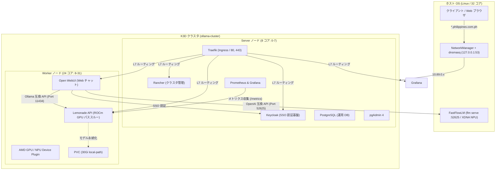

# ollama-on-k3d

Podman 環境上で K3D を用い、ホストの CPU リソースを最適分離してローカル AI / LLM ワークロード（Lemonade, FastFlowLM, Open WebUI）を完全自動デプロイするプロジェクトです。

---

## 概要

- **コンテナランタイム**: Podman (system モード、sudo で実行)
- **オーケストレーション**: K3D (K3s in Docker)
- **CPU コア分離**:
  - **Server ノード**: 8 コア (`0-7`) - コントロールプレーン、CORE、SSO、監視基盤
  - **Worker ノード**: 24 コア (`8-31`) - AI / LLM 推論基盤 (Lemonade, FastFlowLM, Open WebUI)
- **ハードウェアアクセラレーション**:
  - AMD GPU / ROCm パススルー (`/dev/kfd`, `/dev/dri`)
  - AMD NPU / XDNA パススルー (`/dev/accel`) & Turbo モード自動有効化 (最大クロック/性能)
- **Web UI & 認証**:
  - Open WebUI (Local AI チャットフロントエンド)
  - Keycloak (OIDC 統合認証基盤、ワンクリック SSO)
  - Rancher Manager (完全日本語化)
  - Grafana (日本語対応、Lemonade / AMD NPU 監視ダッシュボード)
  - pgAdmin 4 (PostgreSQL Web 管理)
- **ストレージ**: K3s 標準 `local-path` (軽量 host-path 永続化)
- **完全自動化**: Shell スクリプト (`start.sh` / `stop.sh`) & Ansible Playbooks (`ansible/`)

---

## 前提条件

- **OS**: cgroup v2 対応 Linux (Ubuntu 22.04 / 24.04 等)
- **CPU**: 32 コア以上推奨 (AMD Ryzen AI Max+ 395 等)
- **メモリ**: 32 GB 以上推奨
- **Podman**: 5.0 以上
- **k3d**: v5.8.0 以上
- **kubectl**: v1.28 以上
- **helm**: v3.12 以上
- **Ansible**: Core 2.15 以上 (コレクション: `community.general`, `kubernetes.core`)

---

## クイックスタート

### 1. クラスタの起動

`start.sh` を実行すると、設定ファイル (`config.env`) を読み込み、Ansible 経由でクラスタ構築から各種 AI スタック、監視基盤、SSO 連携までが完全自動でデプロイされます。

```bash
# 1. 必要に応じて設定をカスタマイズ
vim config.env

# 2. クラスタ起動 (全自動)
./start.sh
```

デプロイ完了後、端末末尾に各コンソールの URL と初期認証情報が出力され、ホストの `~/.kube/config` に kubeconfig が自動配置されます。

### 2. AI モデルのダウンロード (Pull)

クラスタ起動後、`lemonade-pull.sh` を使用して Kubernetes 上の Lemonade Pod に直接モデルをダウンロード・永続化できます (`start.sh` はデプロイ末尾で `LEMONADE_DEFAULT_MODEL` を自動 pull します)。

```bash
# モデルのダウンロード
./lemonade-pull.sh pull Qwen3.8-27B-GGUF
./lemonade-pull.sh pull Qwen3-4B-GGUF

# ダウンロード済みモデル一覧確認
./lemonade-pull.sh list

# モデルの削除
./lemonade-pull.sh rm <モデル名>
```

### 3. Web チャット UI の利用

ブラウザで `https://chat.philippines.com.ph` にアクセスし、Keycloak SSO でワンクリックログインすることで、すぐにローカル AI との対話やコーディング支援を利用できます。

### 4. クラスタの停止・クリーンアップ

```bash
./stop.sh
```

停止時に稼働中のコンテナイメージが `images.txt` へ自動保存され、Podman のローカルストレージへキャッシュされるため、次回起動が高速に行われます。

---

## ワークロードとノード配置アーキテクチャ

ホストの CPU リソースを物理的に 2 分割し、管理機能と推論機能が互いに影響を与えないよう設計されています。



---

## 各サービス公開 URL & 初期アクセス情報 (デフォルト)

| サービス名 | 公開 URL | 認証方式 | 初期管理者ユーザー | 配置ノード |
| :--- | :--- | :--- | :--- | :--- |
| **Open WebUI** | `https://chat.philippines.com.ph` | Keycloak OIDC SSO (ワンクリック) | `admin` | Worker (24コア) |
| **Lemonade API (Ollama 互換)** | `https://lemonade.philippines.com.ph` | API Direct (`/api/tags`) | - | Worker (24コア) |
| **FastFlowLM (OpenAI 互換)** | `http://10.89.0.1:52625/v1` (ホスト直結・非公開) | 内部 API | - | ホスト (Worker ノード側) |
| **Keycloak 管理画面** | `https://keycloak.philippines.com.ph/admin` | 管理者認証 | `admin` / `admin` | Server (8コア) |
| **pgAdmin 4** | `https://pgadmin.philippines.com.ph` | Keycloak OIDC SSO | `admin@philippines.com.ph` / `admin` | Server (8コア) |
| **Grafana** | `https://grafana.philippines.com.ph` | Keycloak OIDC SSO | `admin` / `admin` | Server (8コア) |
| **Traefik Dashboard** | `https://traefik.philippines.com.ph/dashboard/` | Keycloak OIDC SSO | `admin` / `admin` | Server (8コア) |
| **Rancher Manager** | `https://rancher.philippines.com.ph` | Keycloak OIDC SSO | `admin` / `admin12345` | Server (8コア) |

---

## テストの実行

構文チェック・単体テスト、およびクラスタ全体の E2E ライフサイクルテストを実行できます。

```bash
# 1. 単体・構文テスト (非破壊・高速)
./test.sh --unit

# 2. 全体 E2E ライフサイクルテスト (起動 -> 検証 -> 停止)
./test.sh --e2e -y
```

---

## コンポーネント自動アップグレード

```bash
# アップグレード可能コンポーネントの確認 (ドライラン)
./upgrade.sh --check

# 最新バージョンへの自動アップグレード実行
./upgrade.sh -y
```

---

## 関連ドキュメント

- [spec.md](file:///home/masashi/ai/projects/ollama-on-k3d/spec.md) … 詳細仕様書
- [AGENTS.md](file:///home/masashi/ai/projects/ollama-on-k3d/AGENTS.md) … 運用・開発エージェント向け指示書
- [NETWORK.md](file:///home/masashi/ai/projects/ollama-on-k3d/NETWORK.md) … ネットワーク構成仕様書
- [TEST.md](file:///home/masashi/ai/projects/ollama-on-k3d/TEST.md) … テスト仕様書
- [goal.md](file:///home/masashi/ai/projects/ollama-on-k3d/goal.md) … プロジェクト目標・アーキテクチャ概要